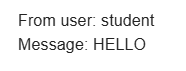

# SA | Hands-on 9: Message Brokers

## Team Members

Team ID: 3

Anushervon Qodirzoda | Ilias Dzhabbarov  |  Muhammad Allayarov

## Installation

1. Install docker
2. Rename `.env.example` to `.env` and put credentials:
```
FROM - sender email
PASS - sender's application password (on google accounts 2FA required)
TO - reciever email
```

3. Run the docker app
```bash
docker compose up --build
```


## Testing the systems

### Brokers:

#### 1 message. 

Docker logs (UTC time):

Message recieved by API Service at:

`api_service        | 2024-12-06 19:23:25,166 | publisher | INFO | Message recieved at: 2024-12-06 19:23:25.165950`

Message sent by Publisher service at:

`publisher_service  | 2024-12-06 19:23:28,595 | publisher | INFO | Send email`



Time for sending one email: ~3.429 seconds

But only one email is not very showcase, for more accurate result, we can send 100 emails and get average time. In this case with 1 email we used FastAPI Swagger, but for 100 we can use Pytest and check again docker logs.

#### 100 messages. 

Docker logs:

First message recieved by API service at:

`api_service        | 2024-12-06 19:35:40,917 | publisher | INFO | Message recieved at: 2024-12-06 19:35:40.917308`

Last message sent by Publisher service at:

`publisher_service  | 2024-12-06 19:40:58,686 | publisher | INFO | Send email`

In total: ~5 min 17.769 sec = ~317.769 seconds

Dividing by 100 we get: ~3.17769 seconds per message or ~18.88164 messages per minute - the system's throughput

### Pipes

#### 1 message.

#### 100 messages.

## Demo

[Link]()

## Sources and links

<<<<<<< HEAD
[Application passwords for google](https://myaccount.google.com/apppasswords)
=======
[Application passwords for google](https://myaccount.google.com/apppasswords)
>>>>>>> main
